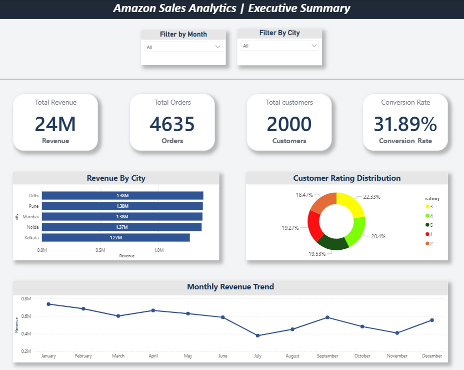
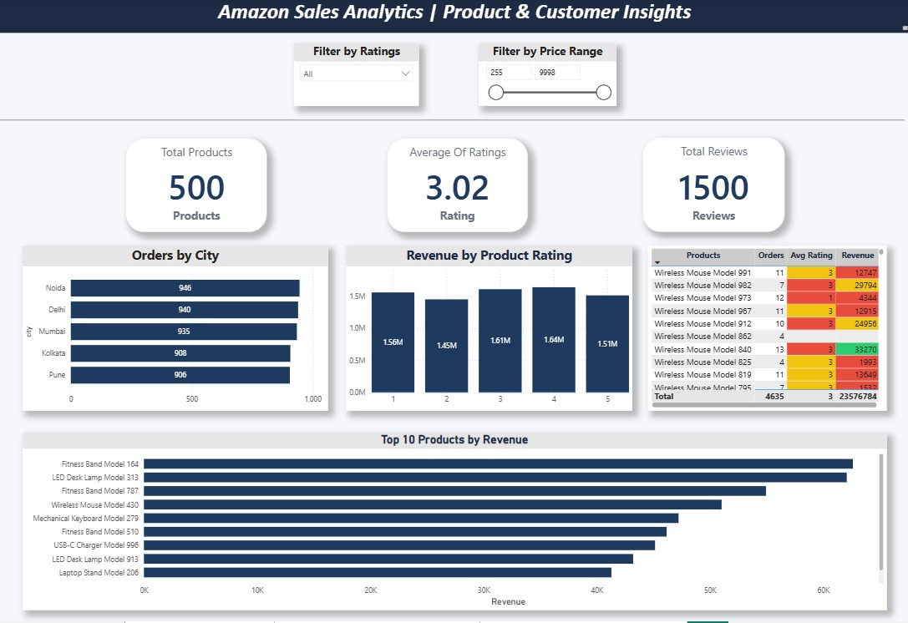
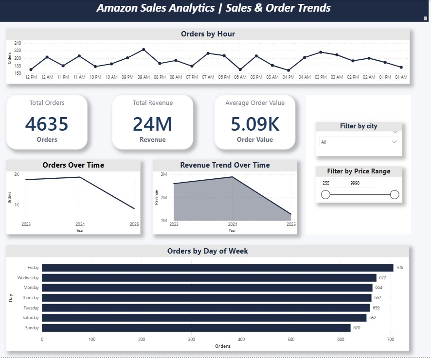

# amazon-sales-analytics-dashboard
End-to-end Amazon sales analytics project using MySQL and Power BI to analyze customer behavior, product performance, and revenue trends through interactive dashboards.

## Tools Used
- MySQL
- Power BI

 
## Dashboard Preview

### Executive Dashboard

### Customer & Product Insights Dashboard

### Sales & Order Trends Dashboard

## Key KPIs
- Total Revenue
- Total Orders
- Conversion Rate
- Customer Ratings

## Key Insights
- Sales are concentrated in major cities
- A few products drive most revenue
- Orders peak during specific hours

- ## Key Insights
- Sales performance varies across different cities.
- A small number of products generate the majority of orders.
- Customer satisfaction is moderate based on average ratings.
- Orders tend to peak during specific hours of the day.

---

## Recommended Actions
- Promote top-selling products to maximize revenue.
- Improve low-rated products based on customer feedback.
- Focus marketing efforts on high-performing cities.
- Run promotional campaigns during peak order hours.

- 
## Conclusion
The project demonstrates how SQL and Power BI can be used together to transform raw transactional data into actionable business insights.  
The dashboards help businesses monitor performance, understand customer behavior, and support data-driven decision making.

